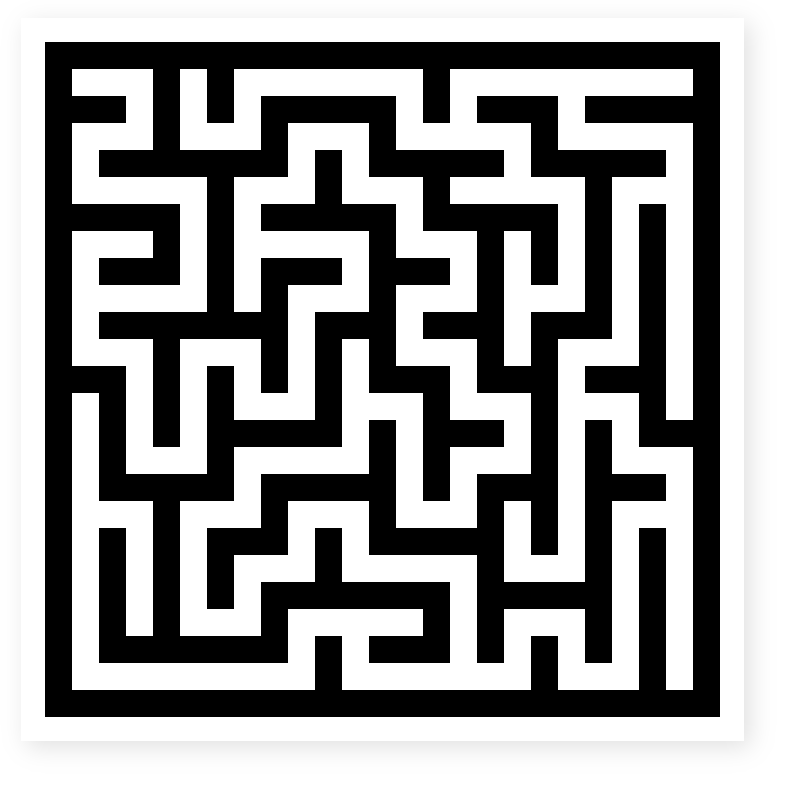

# Table Maze
Copyright 2019 Brian Puthuff

Redistribution and use in source and binary forms, with or without modification, are permitted provided that the following conditions are met:

Redistributions of source code must retain the above copyright notice, this list of conditions and the following disclaimer.

Redistributions in binary form must reproduce the above copyright notice, this list of conditions and the following disclaimer in the documentation and/or other materials provided with the distribution.

THIS SOFTWARE IS PROVIDED BY THE COPYRIGHT HOLDERS AND CONTRIBUTORS "AS IS" AND ANY EXPRESS OR IMPLIED WARRANTIES, INCLUDING, BUT NOT LIMITED TO, THE IMPLIED WARRANTIES OF MERCHANTABILITY AND FITNESS FOR A PARTICULAR PURPOSE ARE DISCLAIMED. IN NO EVENT SHALL THE COPYRIGHT HOLDER OR CONTRIBUTORS BE LIABLE FOR ANY DIRECT, INDIRECT, INCIDENTAL, SPECIAL, EXEMPLARY, OR CONSEQUENTIAL DAMAGES (INCLUDING, BUT NOT LIMITED TO, PROCUREMENT OF SUBSTITUTE GOODS OR SERVICES; LOSS OF USE, DATA, OR PROFITS; OR BUSINESS INTERRUPTION) HOWEVER CAUSED AND ON ANY THEORY OF LIABILITY, WHETHER IN CONTRACT, STRICT LIABILITY, OR TORT (INCLUDING NEGLIGENCE OR OTHERWISE) ARISING IN ANY WAY OUT OF THE USE OF THIS SOFTWARE, EVEN IF ADVISED OF THE POSSIBILITY OF SUCH DAMAGE.

## Description
A simple HTML/CSS/JavaScript maze generator.

## Use
Link the ```table_maze.js``` and ```table_maze.css``` to your HTML file. See example HTML file (```table_maze.html```).
In your HTML file, within script tags, call the **```aMazeMe(w, h)```** function.
Replace the ***w*** with an apporpriate width value, and ***h*** with an appropriate height value.

example: ```aMazeMe(33, 15);```


Note: you can make the height be the same as the width by just entering the width argument alone.

example: ```aMazeMe(25);```



Dimensions must be greater than 3, and must be odd. If an argument less than 3 is entered, the program will default to 3. If an even value argument is used, the program will increment by one to make it odd.

## Modify
You can modify the ```make_table.css``` file to make cells larger or smaller, and adjust their color as you see fit.


